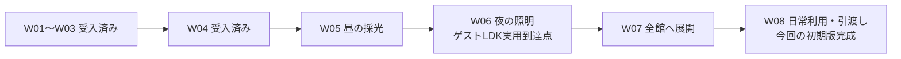

# 実装ロードマップと今回の完成地点

2026-09-09更新。W04-v3（642aeec）は受入済みです。**残りはW05〜W08の4段階**です。W05は詳細仕様READY、W06以降は事前計画（DRAFT）です。前段階の受入時に見直します。本書は古いVISUAL_TWIN_PLAN/STATUS内の進行順より優先します。

## どこで完成とするか

今回の初期版は、図面に基づく自宅＋ゲストハウスを歩き、家具配置・仕上げ・昼の採光・夜の照明を建築前に比較し、その条件を保存・再生成できるツールです。Windows＋Blender＋UEがある施主PCを利用環境とします。

**W06受入がゲストLDKでの実用到達点、W08受入が全館を含む初期版の完成地点**です。ゲストLDKは参考画像を目標に素材と光の見栄えを確認します。全室を参考画像と同じ密度で装飾することや、市販家具の完全再現までは初期版に含めません。完成後も採用品番・図面更新の反映はデータ更新として続けられます。

## 一目で見る進行

| 状態 | 段階 | 施主ができるようになること | 相対的な作業量 |
|---|---|---|---|
| 受入済み | W01 描画復旧 | UEで実際に描画する | 完了 |
| 受入済み | W02 内覧操作 | ゲストLDKを歩き、視点を保存・復帰する | 完了 |
| 受入済み | W03 正本と比較案・ID | 案を保持し、正本の変更/参照切れを確認する | 完了 |
| 受入済み | [W04 面別仕上げ](tasks/W04-surface-finishes.md) | 一面の仕上げを編集し、A/B比較して復元する | 完了 |
| **仕様READY** | [W05 採光](tasks/W05-daylight.md) | 日時・実敷地条件で日差しを比較する | 中 |
| 計画DRAFT | [W06 電気設備・照明](tasks/W06-electrical-lighting-plan.md) | 器具配置を反映し、夜の点灯案を比較する | 大 |
| 計画DRAFT | [W07 全館内覧](tasks/W07-whole-house-plan.md) | 自宅・ゲスト・階段・2階へ対象を広げる | 大〜特大 |
| 計画DRAFT | [W08 日常利用・引渡し](tasks/W08-delivery-plan.md) | 編集から比較記録まで施主自身で使える | 中 |

## あとどのぐらいか

段階数は上記の4つですが、同じ大きさではありません。W05は既存の日時/遮蔽の機能を実用化する作業、W06は新しい設備光源の接続、W07は形状と全館状態の拡張で、後ろにも大きな作業が残ります。「8段階中4番なので半分」とは数えません。

現計画のやり取りは、W04修正の受入後に**4回の実装提出＋4回の受入判断**を基本とします。これは最小の進行単位であり、修正往復や外部資料待ちを含む所要日数ではありません。トークン制限、施主/施工会社の入力待ち、実機生成時間の実績が揃っていないため、カレンダー日数や完了日を現時点で断定しません。各受入時に実際の実装/修正回数と残量を更新し、見通しを具体化します。

| 残量が変わる要因 | 主に影響する段階 | 対応方針 |
|---|---|---|
| 真北・周辺寸法が未確認 | W05 | 入力機能は先行、仮条件と実敷地確認済みを分ける |
| 器具の品番/IESが未確定 | W06 | 仮仕様を明示して機能を完成、後でデータ差替え |
| 階段・建具・屋根の不足 | W07、一部W05 | 既存資料を棚卸し、必要な形状を正本から接続 |
| 複数室/階へ広げた際の状態・面対応 | W07 | W04の契約を拡張し、旧案を維持する |
| 使う途中で操作が分からなくなる | W08 | 施主の代表手順に沿って入口と案内を整える |

## 各受入時に計画を見直す手順

1. 前段階の実成果と未完了/非阻害残件を確定します。報告だけで完了へ変更しません。
2. 次のDRAFTの前提・必要入力・対象ファイルを現行実装へ照合します。
3. 「このまま一括」「範囲/順序を修正」「具体的な理由で分割」のいずれかを判断します。原則は1つのWにつき1つの実装指示・報告・レビューです。内部工程/コミットは自由に分けます。
4. 仕様を具体化してREADYへ変更し、Claudeへの指示を渡します。先のDRAFT全部を一斉に実装する指示ではありません。
5. 本表の状態・相対作業量・中間到達点への影響を更新します。残件を次へ渡すときは対象Wを明記し、忘れたまま完了としません。

W05の詳細化では特に、素材品質、実面の分離、案/contextの整合性、操作UI、保存状態の契約がW05の前提として揃ったか確認します。[W04レビュー](tasks/W04-review.md)の修正5項目を増やすためにこの計画を使いません。

## 全段階で守る境界

- 建物/家具/設備の形状と配置は既存共有JSON、見栄えはvisual設定/生成器、比較条件は版付き状態に分けます。Three.jsだけのlocalStorage変更は正本取込まで反映されません。
- 推測を図面確定値へ変えず、status/noteを維持します。実敷地データと個人資料は非公開ローカルに保持します。
- 検証は代表的な正常系と簡単な異常系を基本とし、無関係な過去テストや多重障害の再実行を要求しません。
- 定量照度の保証、VR/スマホ/配布exe、全室の写真同等化は追加検討です。植物・布の細かい作り込みは引き続き後回しです。
- GPTが仕様/レビュー、Claudeが実装を担当します。実装モデルの運用は現在のSonnetを基本にし、原因不明の難所が続く場合だけ担当/モデルを再判断します。

## 計画変更記録

- 2026-09-09：W04修正中にW05〜W08をDRAFTとして先行文書化。W06をゲストLDK実用到達点、W08を初期版の終点として明示。前段階の受入後に修正・必要なら分割する運用を追加しました。

- 2026-09-09：W04-v3を受入。W05は既存計算/遮蔽/保存を利用して一括実装と判断し、詳細仕様をREADY化。実敷地情報の確認待ちは機能確認と分離します。
