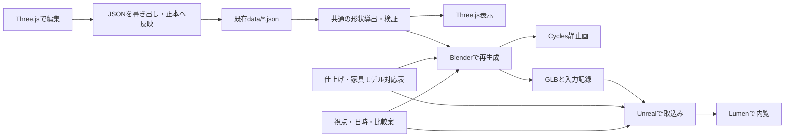

# 内装・採光デジタルツインの実装方針

2026-09-06更新。自宅とゲストハウスが一棟になった未竣工住宅を、建築前の意思決定に使います。
今回の方針は、過去のSTATUS.mdに残る「Three.jsかBlenderか未決定」を更新するものです。
Three.jsは設備・配置編集、Blenderは形状生成と静止画、Unreal Engineは質感・光を変えながらの内覧を担当します。
Three.jsでも写実表現は可能ですが、このプロジェクトでは既存の編集機能を維持し、高品質な内装表現を別の描画環境で作る方が適しています。

## 1. 最初に作る体験と成果物

最初はゲストハウスLDKです。施主から着手順の判断を任されており、一枚の片流れ屋根で天井形状がまとまるため、先行検証に適しています。
そこで確立した仕組みを、勾配天井と平天井の境界に段差がある自宅LDKへ展開します。最終的には一棟全体を扱います。

| 成果物 | 判断できること | 条件 |
|---|---|---|
| 同じ視点・同じ露出での内装A/B/C比較画像 | 壁紙、床、建具、家具の組合せ | 実寸の材質スケール、PBR材質、視点固定 |
| 季節×時刻の比較画像 | 日差しが届く場所、庇の影、室内奥の相対的な暗さ | 真北、地域、日時、窓、遮蔽物を設定 |
| 昼／夕方／夜の比較 | 自然光と照明による印象の変化 | 夜は器具の光束・配光・色温度が必要 |
| Unrealの操作可能な内覧 | 家具の圧迫感、素材変更、時間帯変更 | 動作するPC向け。実機で性能測定 |
| 施工会社との打合せ用画像と条件表 | 何を変更したいか、どの仕様が未確定か | 画像に案名・条件・未確認仕様を添付 |
| 再生成可能な.blend／GLB／設定／入力記録 | 図面やThree.js側の変更後の作り直し | スクリプトと正本JSONを保持 |

4K静止画、短い内覧動画、360度パノラマも後段の出力候補です。最初は少数の視点・比較条件で品質を確立し、量産はその後に行います。
Unrealの操作体験は最初はローカルPC用です。スマホでの共有は画像・動画、既存Three.jsは配置編集に使います。配信サーバーを必要とするPixel Streamingは初期範囲に含めません。

## 2. 共通データからの一方向生成



- 建物・部屋・屋根は`data/house.json`、家具は`furniture.json`、電気設備は`electrical.json`、窓・ドアは各配置JSONを引き続き正本とします。各カタログも参照します。
- ブラウザのlocalStorageは下書きです。**ブラウザで動かすだけではBlenderへ反映されません。JSONを書き出し、正本に取り込んでから再生成します。**
- Three.jsのメニューや色だけの変更はBlenderへ移植不要です。新しい建具方式・天井方式などの追加は、共通データ契約と各描画環境の対応を更新します。「どんな変更でも自動追従」とはしません。
- 壁の導出は既存の`scripts/build-web-data.mjs`を再利用します。内壁・外壁をPythonで再導出しません。勾配天井の区画分解・床と天井の階段開口も共有JSONへ出力し、WebとBlenderで同じ導出結果を使います。
- Blenderで建物の壁位置を手修正しません。高品質な家具モデルへの置換は、既存家具IDとモデルの対応表で再適用します。寸法が異なるモデルは自動で無理に伸縮せず、差を報告します。
- 新設予定の`data/visual/finishes.json`・`asset-bindings.json`・`scenarios.json`は、見た目と比較条件だけを持ち、部屋寸法を複製しません。現時点では設計案で未実装です。
- `note`・`status`・`provenance`は保持し、推測値を確定値へ変更しません。

### 再取込みで仕上げを失わないための設計

仕上げの割当は、部屋ID＋面の役割（床、天井、壁の室内側）を基本にします。一枚の壁の両側で別の壁紙を指定できる構成にします。
**現在の自動導出壁IDは配列順から採番されるため、部屋分割で変わり得ます。永続的な仕上げ割当キーとしては使いません。**
壁のどの部分かを識別する参照方法を共通出力で定義し、部屋や面の削除・分割で参照が曖昧になった場合は「割当要確認」として止めます。

Unrealでは生成物用のフォルダ／レベルと、材質・比較UI・視点のフォルダ／レベルを分離します。
初期は建物を丸ごと再生成し、ID参照で設定を再適用します。部品単位の差分取込みは、追加・移動・削除の検証が通ってからです。
窓を一つ移動して再取込みし、既存の材質割当とカメラが維持されることを最初の受入テストにします。

## 3. BlenderとUnrealの受け渡し

初期候補はBlender標準のglTF 2.0／GLB出力とUnrealのInterchange取込みです。
Epicの公式ドキュメントでglTF取込み・再取込みの仕組みを確認しました。ただし再取込み時の材質やActorの保持は実際のUEバージョンで検証してから保証します。
Blenderのノード材質すべてをそのまま転送できる前提にはしません。共通化するのは主にBase Color・Roughness・Metallic・Normal等で、プロシージャル材質は必要に応じてベイクし、ガラスは各エンジンで実装・比較します。
DatasmithのBlender公式Direct Linkを前提とせず、まず標準のGLB経路で小さく検証します。

座標は現行通り、建物ローカルの東向きx・南向きz・上向きy、単位m、原点GLです。Blenderは`(X,Y,Z)=(x,-z,y)`です。
GLBでは標準エクスポータの軸変換を使います。UE側はcm系なので、取込み時に1mの検証物・1F床GL+0.707m・2F床GL+3.439m・北の方向を照合します。手動100倍とインポータ換算を重ねません。
現在の図面ローカル方位と測量上の真北が一致するかは、別途確認します。

公式資料（2026-09-05参照。導入するUEバージョンに固定して実機検証します）：

- [Interchangeの取込み・再取込み](https://dev.epicgames.com/documentation/en-us/unreal-engine/importing-assets-using-interchange-in-unreal-engine)
- [glTF対応](https://dev.epicgames.com/documentation/en-us/unreal-engine/gltf-file-format-support-in-unreal-engine)
- [Datasmith対応アプリケーション](https://dev.epicgames.com/documentation/unreal-engine/datasmith-supported-software-and-file-types?lang=en-US)
- [Lumenの技術的制約](https://dev.epicgames.com/documentation/unreal-engine/lumen-technical-details-in-unreal-engine)
- [Path Tracer](https://dev.epicgames.com/documentation/en-us/unreal-engine/path-tracer-in-unreal-engine)
- [地理情報からの太陽位置](https://dev.epicgames.com/documentation/unreal-engine/geographically-accurate-sun-positioning-tool-in-unreal-engine?lang=en-US)

## 4. 採光を比較するための条件

単に画像を明るくするのではなく、差の原因を追える比較にします。

1. **日差しの位置**：地域、真北、日付、現地時刻（JST）、庇、窓の有効開口、隣家・塀・地形を設定します。
2. **室内での明るさの印象**：ガラスの可視光透過率、サッシ、壁・床・天井の反射特性、晴天／曇天を加えます。
3. **夜間照明**：設備の「配置」と光源の「性能」を分けます。電灯配線数から明るさを決めません。実器具の光束、色温度、IES配光、調光率を入力します。
4. **公平な比較**：同じ比較組では視点、画角、露出、ホワイトバランス、色管理、レンダー設定を固定します。自動露出で暗い部屋が勝手に明るく補正される比較は避けます。

最初の比較セットは夏・中間期・冬の各1日×9時／12時／15時、晴天を基本とし、曇天・夕方・夜は次に加えます。日付はケースファイルに明記します。
壁紙案の比較では日付を固定し、時刻比較では材質を固定します。一度に複数の条件を変えません。

Lumenは操作中の確認、Cycles／UE Path Tracerは静止画の比較に使います。両者の見え方は一致を仮定せず、同じ視点で突き合わせます。
**現段階では写実画像から照度lux、年間採光性能、断熱・日射熱取得を算定しません。** 数値性能が必要になれば、同じ形状からRadiance等の専用計算へ接続する別工程を設けます。
壁紙の実際の色は撮影・モニターにも左右されるため、最終候補は実物サンプルとも突き合わせます。

住所や正確な緯度経度を公開Gitへ入れません。敷地条件は当面`build/`配下のローカル設定に保存し、共有出力への位置情報の混入も確認します。

## 5. 現状監査と実装順

2026-09-05に実行コードと正本を確認しました。過去のSTATUS.mdの件数は時点が混在しているため、現在の数は検証スクリプトを基準とします。
作業開始時点で33室、家具40件、外部開口19件、室内ドア・開口31件、電気設備143件です。
Blender 5.2.0 LTSとRTX 5060 Ti（VRAM約16GB）を確認しました。UEはPATH・標準ディレクトリ・Launcher登録の確認範囲で見つかっていません。別ドライブへの導入有無は未確認です。UE性能は未測定です。

| 段階 | 実装内容 | 完了条件 |
|---|---|---|
| 0：更新できる土台 | 分離worktree、外壁修正、検証付き.blend／GLB生成、入力記録 | 正本を変更せず再生成でき、座標・寸法が転送で保たれる |
| 1：ゲストハウスLDKの形状 | 勾配天井、壁上端、取り合い、アーチ、窓枠とガラス、主要家具 | 正本と平面・断面が整合し、意図しない光漏れがない |
| 2：最初の内装・採光比較 | 仮仕上げ3案、固定視点、地域・方位・日時、周辺遮蔽物 | 同じ条件で比較できる画像と条件記録を出せる |
| 3：Unrealで操作 | GLB取込み、PBR、Lumen、視点・時刻・材質切替 | 1m・床高・方位が一致し、変更／削除後も材質と視点を維持 |
| 4：自宅LDKから一棟へ | 段差天井、階段・床開口・腰壁、設備、各室の仕上げ | 両LDKと主要動線を一つの建物として比較・内覧できる |

段階1でもゲストLDK以外の建物は遮光物として維持します。室内を見やすくするための「壁を隠す表示」を採光計算に流用しません。
未モデル化の妻壁・南東部下屋、屋根端部、サッシ仕様、天井下地の見込みは、影響する検討を始める前に確認または明示した仮定で補完します。
施工会社に優先して確認するのは、天井断面・窓の製品とガラス仕様・庇寸法・照明器具仕様です。既存図面から読める情報は先に調べ、読めない点だけを整理します。

## 6. このブランチで実装した範囲

段階0〜2のゲストハウスLDK試作と、段階3のUnreal取り込み・固定視点を実装しています。**実所在地・日時による採光評価、Unrealの専用内覧UIは未完了です。**

- `build_house.py`の外壁を、求積ゾーンの四辺を毎回作る実装から`generated/exterior-walls.json`を読む実装へ変更しました。区画境界の架空壁を除きます。
- ゾーンの継ぎ目をまたぐ窓を、両方の外壁セグメントから切り欠きます。壁外へ張り出す開口で壁メッシュが勝手に延長される問題も防ぎます。
- `--glb`を追加しました。内装版GLBをUE 5.8.2のInterchangeで取り込み、全545メッシュの名前・外形を検証しました。
- `scripts/build-visual-twin.py`で既存データ検証・生成物の鮮度確認・外壁回帰検証を行い、別プロセスのBlenderで生成します。開いているBlenderシーンは操作しません。
- 出力ごとに正本・生成JSON・実装・検証コードのスナップショットとSHA-256、元コミット、Blenderバージョン、成果物ハッシュを保存します。途中で入力が変わった場合は失敗させます。
- 出力先が既に存在する場合は上書きせず停止します。生成物は既存の`build/`除外ルールの対象です。

`--interior`を付けると、別の内装生成アダプタ`blender/build_interior.py`を使います。
共有の`generated/visual-envelope.json`から平天井・勾配天井・床開口を生成し、壁上端を天井へ合わせ、アーチと段差の垂れ壁、腰壁、窓枠・仮ガラスを作ります。
ゲストLDKの家具10件は正本から位置・回転・寸法を解決し、ベベルのある簡易部品で組み立てます。所属は移動後に古くなるroom文字列ではなく、配置座標と部屋ポリゴンで判定します。実際の家具製品の再現ではありません。
仕上げ・視点・太陽角度は`data/visual/guest-ldk-study.json`に保存します。白壁＋ナチュラルオーク、グレージュ＋ウォルナットの2案を同じ露出で比較できます。

内装版は診断用ドアマーカーを使わず、実扉がある開口だけ閉じた扉を生成します。ガラスは反射・屈折を持ちますが、影の計算は1面あたり透過率0.9（板の両面通過で約0.81）の簡略化を使い、実際のガラス製品に校正していません。
太陽の方位角は図面北0度から時計回り、太陽高度は水平0度から上向きです。現時点では手動角度であり、実際の季節や時間帯には対応しません。
Blender 5.2の天空モデルはMultiple Scatteringを使用します（[公式マニュアル](https://docs.blender.org/manual/id/5.2/render/shader_nodes/textures/sky.html)）。比較間で視点・露出+2.5EV・AgXを固定します。

階段の踏板、周辺建物・実測方位、屋根細部、照明器具の性能、ゲストLDK以外の家具は未対応です。材質のプロシージャル細部とガラスの影用シェーダーはGLBだけでは同等に転送されず、UE向けの材質対応が必要です。
これらの制約は`study.json`・`manifest.json`にも記録し、`daylightReady:false`を維持します。内装版を指定しない白模型出力は従来の診断用途です。

### 再生成コマンド（専用worktreeをカレントディレクトリにします）

```powershell
python scripts/build-visual-twin.py --blender 'C:/Program Files/Blender Foundation/Blender 5.2/blender.exe' --output build/visual-twin-v1
```

内装の生成・レンダー・形状検証・GLB往復検証を一度に実行します。出力先は毎回新しい名前にします。

```powershell
python scripts/build-visual-twin.py --blender 'C:/Program Files/Blender Foundation/Blender 5.2/blender.exe' --interior --variant natural --output build/guest-natural-v1
python scripts/build-visual-twin.py --blender 'C:/Program Files/Blender Foundation/Blender 5.2/blender.exe' --interior --variant warm --output build/guest-warm-v1
python scripts/build-visual-twin.py --blender 'C:/Program Files/Blender Foundation/Blender 5.2/blender.exe' --interior --elevation 60 --output build/guest-high-sun-v1
```

各出力には`interior.png`・`interior.blend`・`interior.glb`・`study.json`・`manifest.json`・`verification.json`・入力スナップショットが含まれます。
`--width`（既定1600）と`--samples`（既定128）で画質を調整できます。GPUが利用可能ならCyclesのOptiXを使い、利用できない場合はCPUで生成します。

最新mainとの差分確認では、`interior-white-model.html`と既存の3つの生成ファイルの内容が一致しています。今回の共通生成処理への変更は`visual-envelope.json`の追加出力です。
内装版の検証では、545個の閉じたメッシュ、ゲストLDK天井5地点のGL高さ、窓の前の壁塞がり、GLB往復時の物体名・外形を確認しています。これらは部屋全体の完全な光漏れ検証や実測採光の保証ではありません。

生成物が古いと表示された場合は、正本への意図した変更であることを確認して`node scripts/build-web-data.mjs`を実行し、再試行します。

GLBをBlenderへ戻して座標・寸法・物体名・外壁メタデータを検証するコマンドです。`--render-plan`は屋根と2Fを隠した診断用1F平面画像も出力します。

```powershell
& 'C:/Program Files/Blender Foundation/Blender 5.2/blender.exe' --background --factory-startup --python-exit-code 1 --python tests/validate_blender_export.py -- --package build/visual-twin-v1 --render-plan
```

この往復検証はUE取込みの検証を代替しません。既存検証の合格も、レンダリング用の閉じた形状・窓の光学特性・正しい採光を保証するものではありません。

## 7. Claude Codeとの並行作業

- 施主が電気設備ブランチをPR #10でmainへマージし、削除しました。元の作業フォルダは現在`main`です。
- 今回は引き続き`feature/visual-twin-foundation`、独立worktreeは`build/worktrees/visual-twin`です。再開時に最新mainの`190a135`までfast-forwardで取り込み済みです。
- 電気設備UIの最新変更を保持し、元の作業フォルダの`.claude/`には手を加えていません。
- 今後はThree.js側の確定したデータ更新をコミット単位で取り込み、再生成・検証します。作業中の元フォルダに対してstash・reset・ブランチ切替を行いません。
- 共通導出処理を変更するPRでは、既存のWeb出力・データ検証に加えてBlenderの形状検証も実行します。
- 本書に詳細を記録し、README・STATUSから参照します。共通データ契約の追加出力はARCHITECTUREにも記載します。

## 8. Unreal Engine 5.8.2の再生成と確認

`scripts/build-unreal-study.py`は検証済みBlenderパッケージを新しいUEプロジェクトにコピーし、Python commandletで取り込みます。完成条件は`import-verification.json`が存在し、全メッシュの外形差が1mm未満であることです。実機では最大0.000061cmでした。変換は`UE(X,Y,Z)=(source x,source z,source y)×100`です。

```powershell
# 専用worktree内から実行。キャッシュは元リポジトリのbuild/ddcに置きます。
python scripts/build-unreal-study.py --engine 'C:/Program Files/Epic Games/UE_5.8' --package build/guest-natural-v2 --output build/ue-natural-v1 --cache '../../ddc'
python scripts/capture-unreal-study.py --engine 'C:/Program Files/Epic Games/UE_5.8' --project build/ue-natural-v1 --cache '../../ddc'
```

通常のチェックアウトでは、`--cache build/ddc`など119文字以内の書き込み可能な絶対パスになる指定を使います。UEのファイルシステムDDCには長さ制限があります。Python commandletへ渡すパスはスラッシュ区切りにします。Windowsのバックスラッシュを使うと`\r`などが制御文字へ展開されるためです。

生成した`RyukaInterior.uproject`を開くと、`/Game/Generated/House`に建物とゲストLDKの確認用カメラがあります。アウトライナーの`Camera_guest_LDK`を右クリックし「パイロット」で固定視点を確認できます。エディタの通常移動も使えますが、専用の歩行操作・当たり判定・実行形式へのパッケージングはまだありません。

材質はBlenderの選択案から基本色を再適用します。Lumen、ハードウェアレイトレーシング、太陽光と天空光、固定露出を設定します。初回はシェーダー準備に時間がかかります。既定は仮の50,000luxとEV100=7.5で、`--sun-lux`・`--exposure-ev100`により変更できます。Blenderの強度・露出との数値的な同一性や、エンジン間の色一致は保証しません。

UEのガラスは仮の半透明材質で、影を無効化しています。Blenderのガラスと透過率は一致しません。木部・壁・布には9節の仮の表面模様と粗さを追加していますが、実製品の木目・壁紙凹凸・ガラス光学特性への置換は次の品質改善段階です。

前回プロジェクトは上書きしません。既定の仕上げ案とカメラは`data/visual/guest-ldk-study.json`から再適用します。9節の比較条件は保存・引き継ぎできます。**UE内の任意のメッシュ編集・独自材質・家具移動を次回出力へ合成する機能はありません。**建物と家具の変更は正本へ反映します。

出力は`.uproject`、`Content`、元パッケージ`SourcePackage`、取り込みスクリプト、条件`import-job.json`、検証結果を含みます。キャプチャは`Saved/interior-unreal.png`に保存します。ソースパッケージの`unrealImportVerified:false`はBlender生成時点の記録として保持し、UEでの検証結果はプロジェクト側へ追記します。

キャプチャは`--name interior-unreal-final`など別名で追加できます。同名の画像を上書きしません。GI・反射をCinematic品質にし、読み込み完了と光の蓄積を待って1600×900で撮影します。画像と同名のJSONにハッシュ・実行時のレイトレーシング有効状態を記録します。RTX 5060 TiでDX12／SM6の有効化と画像生成を確認済みです。見た目はまだ簡易家具・仮材質の段階であり、実製品の再現ではありません。

更新受入テストはコピー内だけで南窓`op-006`を10cm移動し、再生成したBlenderの窓外形移動、カメラ・仕上げ設定の保持、UE全メッシュの外形一致、元の正本が不変であることを検証します。

```powershell
python tests/validate_visual_regeneration.py --baseline build/guest-natural-v2 --output build/regeneration-v2 --blender 'C:/Program Files/Blender Foundation/Blender 5.2/blender.exe' --engine 'C:/Program Files/Epic Games/UE_5.8' --cache '../../ddc'
```

## 9. 内装比較メニューと条件の引き継ぎ

2026-09-06追加。新しく生成したUEプロジェクトを開き、「ツール（Tools）→ 内装比較」を使います。[UEのToolMenu API](https://dev.epicgames.com/documentation/en-us/unreal-engine/python-api/class/ToolMenu)を使ったエディタ用メニューで、Play実行中や配布用ゲームのUIではありません。

| 操作 | 結果 |
|---|---|
| 白壁・ナチュラルオーク／グレージュ・ウォルナット | 仕上げ2案を切り替えます。視点と太陽・露出は維持します |
| 太陽高度30°／60° | 太陽高度だけを変更します。実際の日時を表す値ではありません |
| 比較カメラを見る | 保存した比較カメラをパイロットします |
| 現在の視点を比較カメラにする | ビューポートの位置・向きを採用します。焦点距離は比較カメラの値を維持します |
| 比較条件とレベルを保存 | 現在のレベルとプロジェクト直下の`study-state.json`を保存します |

自由に視点を動かすときは、カメラのパイロットを解除して通常のエディタ移動を使います。メニューの変更は即時反映し、保存操作までは書き出しません。Undoや手動変更後は、メモリに残った古い条件ではなくシーンの実際の状態を読み取ります。任意のカスタム材質が混ざり、既存2案のいずれにも一致しない状態の保存は停止します。

保存対象は部屋ID、案名、太陽方位・高度、光源強度、固定露出、カメラ位置・向き・焦点距離です。カメラ位置はUEのGL基準cmで保存します。再生成時に床高や壁位置が変わった場合のカメラの自動退避・追従はしません。別の部屋、未知の案、非有限数、不正な範囲の値は適用前に拒否します。色そのものは新しいパッケージの案定義から読み直します。

```powershell
# Three.js側の正本更新後にBlenderパッケージを再生成し、保存した比較条件を適用します。
python scripts/build-unreal-study.py --engine 'C:/Program Files/Epic Games/UE_5.8' --package build/updated-package --output build/ue-updated --cache '../../ddc' --state build/ue-finish-study-v3/study-state.json
```

`--state`を指定した場合、その仕上げ・光源・露出・カメラが既定値と`--sun-lux`／`--exposure-ev100`に優先します。元のSourcePackageは変更しません。材質の割り当てはその都度新しい生成物から`study-bindings.json`を作るため、古い自動採番の壁IDを持ち越しません。

`data/visual/unreal-finishes.json`はUE用の表面模様のスケール・粗さ・色変化を管理します。木部は引き伸ばしたノイズと周期模様、壁・天井・布は細かな色変化です。ワールド座標cmを使い、UVや建物寸法は変更しません。木目方向は建物軸に固定した仮表現で、部材ごとの木取りや実製品の再現ではありません。ファイルを出力へコピーし、ハッシュを記録します。材質ノードの接続失敗は生成時、シェーダーのコンパイル失敗はキャプチャ時にエラーにします。

### 同じ視点での比較画像

```powershell
python scripts/capture-unreal-study.py --engine 'C:/Program Files/Epic Games/UE_5.8' --project build/ue-finish-study-v3 --cache '../../ddc' --name natural --variant natural
python scripts/capture-unreal-study.py --engine 'C:/Program Files/Epic Games/UE_5.8' --project build/ue-finish-study-v3 --cache '../../ddc' --name warm --variant warm
python scripts/capture-unreal-study.py --engine 'C:/Program Files/Epic Games/UE_5.8' --project build/ue-finish-study-v3 --cache '../../ddc' --name high-sun --variant natural --elevation 60
```

撮影時の案・太陽高度指定は一時的な変更です。保存済みレベルのハッシュが変わらないことを検証します。画像ごとに`<name>-conditions.json`と、画像・条件・仕上げ設定のハッシュ、レイトレーシング状態を持つ`<name>.json`を残します。

### 検証

`tests/test_study_state.py`は互換性・範囲・カメラの入力検証です。`tests/validate_unreal_controls.py`はUE Python commandletで実行し、334材質スロットの切り替え、全545メッシュの外形不変、太陽とカメラの保存・復元、不正設定の拒否、メニュー登録を検証します。テストは元の比較条件を復元し、引き継ぎ用の例を`Saved/transfer-state.json`へ残します。

窓を10cm移動したコピーのパッケージへ、この設定を`--state`で引き継いだプロジェクトでも検証済みです。再生成後の検証は次のコマンドで再実行できます。

```powershell
python tests/validate_study_transfer.py --state build/ue-controls-v2/Saved/transfer-state.json --project build/ue-controls-transfer-v2
```
