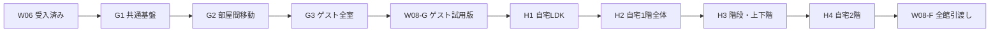

# W07 段階実装設計とゲスト先行案

状態：APPROVED / 施主承認済みの進行計画。2026-09-09。

2026-09-10更新：G1・G2受入完了。[G3詳細仕様](W07-G3-guest-interiors.md)をREADYにしました。承認済みの順序（ゲストG1〜G3→W08-G→自宅H1〜H4→W08-F）は不変で、G3はゲスト8区画の仕上げ・主要設備・照明の展開、W08-Gはその後の施主向け起動・更新・試用導線です。
調査基準：3ceda9b（W06受入後）。製品コードは変更していません。
本書の推奨順序は施主承認済みです。[G1詳細仕様](W07-G1-multi-room-foundation.md)をREADYにしました。以降の単位は各受入後に具体化します。従来の「なるべく分割しない」方針を維持し、今回は施主の依頼に基づき、利用開始を早める具体的な境界で分割します。

## 結論・推奨順序

標準見積は **ゲスト3単位、自宅はその後4単位**です。ゲスト側の3単位に、後で自宅にも使う共通基盤の拡張を含みます。自宅をゼロから別実装する見積ではありません。

推奨は **W07-G1〜G3 → W08-G（ゲスト試用版）→ W07-H1〜H4 → W08-F（全館引渡し）** です。ゲストを施主自身で試せる地点は計4単位後、全館の初期版は計9単位後が標準案です。W07/W08という大きな目的は2つのままですが、実装依頼・受入の単位は9件になります。修正再提出はこの件数に含みません。

この件数は工数や日数の等分ではありません。G1とH3は特に重く、1単位の実装量を揃えるために無理に分割しません。現時点の幅はゲスト3〜4、自宅追加4〜6、W08はゲスト/全館各1です。従って全体9〜12単位程度の可能性があります。日数は実作業・生成待ち・レビュー修正の実測がなく、まだ約束しません。G1受入時に残量を更新します。

## 見積の根拠

| 現状確認 | 設計上の意味 |
|---|---|
| 正本は全33区画。ゲスト候補8、自宅側候補25（自宅1階16・2階9） | 区画数には収納・廊下・階段・土間を含み、33室を写真品質に装飾する意味ではない |
| ゲスト候補は1f-01/02/24/03/04/05/23/06 | トイレ、玄関、ホール、洗面脱衣、UB、洋室、収納、LDK。境界区分はラベル/配置からの設計上の分類。ヌック1f-07は自宅側候補とする |
| 家具正本はゲスト候補23個、自宅側22個（room参照で集計） | 空間数に対して家具の密度が違う。未配置家具や水回り設備の見栄えは別途棚卸しが必要。既存数は完成度の保証ではない |
| 照明正本はゲスト10灯、自宅30灯。現在の型はdownlight/ceiling/pendant | W06の型対応を再利用でき、全器具を新規設計する必要はない。配置・光束は仮仕様 |
| visual-envelopeはゲストLDKに勾配2ピース、自宅LDKに勾配3＋平坦3ピース | 自宅LDKの複雑さは実在するが、形状分割の正本由来データは既にある。新たに屋根を推測し直す段階ではない |
| build_interiorは外皮/建具を広く生成する一方、家具はstudy.roomIdの室に限定 | 全館モデルの完全新規作成より、対象範囲の選択・材質所有・家具適用を一般化する仕事が中心 |
| 内覧は1室polygon、床高さ1個、復帰ZをFloor+88.5へ固定、MaxStepHeight=2cm | 境界を外すだけでは部屋通過/階段復帰を実現できない。歩行空間と現在室を分離する必要がある |
| 扉は現在すべて閉じた静的メッシュ。扉正本は接続する部屋IDの組を持たない | 接続情報の解決と扉の動作・衝突を新たに用意する必要がある |
| 階段は正本に直進→180度回り→直進、13段、床開口、階段下領域がある。Blender内装では踏面未生成 | 形状根拠はあるが、踏面・衝突・上下階判定・段上での保存復帰は新規。段数等はestimatedのまま |

調査対象：data/house.json、家具/電気設備/建具正本、generated/visual-envelope.json、blender/build_interior.py、scripts/enable-unreal-walkthrough.py、unreal/walkthrough/Source/RyukaInterior/Walkthrough.cpp、W07/W08事前計画。既存の図面を今回再解析した見積ではありません。

## 「仕上げる」の到達水準

ゲスト先行版は、全8区画の床・壁・天井・建具と主要家具/設備があり、室を移動し、室別仕上げと昼夜の光を比較できる水準です。収納は内部を確認可能にし、UB等は主要設備の形と寸法が分かる簡易材質で構いません。扉が狭い場所は実寸を優先し、入れない場合は入口から確認/指定視点への切替を明示します。壁抜けを通常内覧として見せません。

ゲストLDKの既存素材品質は維持します。全室に参考LDK画像と同密度の装飾、採用未定の市販品モデル、布/植物の細部を作る作業は含めません。それまで含めるなら上記の分割数では収まらず、部屋ごとの別の内装設計・制作が必要です。

## G1で決める共通契約（自宅追加で作り直さない部分）

### 対象範囲と状態

新規scope定義に安定したscopeIdと対象roomIdsを置きます。guest/home/wholeは同じ建物正本の選択範囲です。外皮・遮蔽物は採光に必要な範囲を残し、未開放の自宅を切り落として光漏れを作りません。部屋IDや家具IDは既存のままです。

比較状態は「全体条件」「室別条件」「内覧位置」を分離します。全体は敷地/太陽/露出/周辺条件、室別は基準仕上げ・面上書き・器具状態、位置はlevel/room/3D座標です。現在注目している室と、案が保存している対象範囲を同一視しません。室を移動しただけで他室の設定が失われない設計にします。

次の版を共通の移行関数で読めるようにし、旧W06案はroom-1f-06だけを持つ案として扱います。複数室モデルへ旧案を適用するときは対象室だけを変更し、他室を既定値で初期化しません。全体条件を同時適用する通常読込と、仕上げ/照明だけを切り替える比較の契約を明示します。案の対象外室、未知室、削除器具は区別します。旧ファイルを勝手に書き換えず、保存時に新版を出力します。

### 面・天井・光源

共有壁は両側に別の面IDと材質スロットを持ち、最初の室側の処理が裏側を消費しない生成にします。床/天井はroom/levelを含む所有関係を維持。混在天井は1つの室の意味上の天井IDから複数の生成ピースへ対応できる方式を維持します。立上り部分の所有/材質は明示し、未登録部分を誤って一括変更しません。

照明は対象scope全体でIDを解決し、グループはその解決集合を参照します。各室生成のたびに他室のグループを参照切れとして拒否する設計を避けます。室の出入りで隣室の灯りが消えないよう、光源を描画室の選択と独立させます。家具も対象roomIdsから集め、同じ家具を部屋境界で二重生成しません。

### 移動・建具

現在室の判定と「歩いてよい範囲」は別です。複数室polygonの各辺へ一律26cmの禁止帯を作ると扉開口も塞がるため、建物の衝突と実開口・室接続を使います。室/階の帰属は床高さと接続情報を考慮し、上下階の同じx/zで取り違えません。

建具IDから両側の室・開口・可動部分を解決する生成bindingsを設けます。曖昧な境界のみ、根拠付きの小さな正本補足で確定します。ラベル文字列を通行判定の正本にしません。スライド/開きなどの既存operationを使い、初版は即時の開閉でも可。扉を非表示にして衝突だけ消す方式にはしません。比較中は扉状態も固定条件に含め、再生成/保存で日差しが変わらないようにします。

ゲストと自宅は原則それぞれの入口から開始し、切替で移動できます。両者を連続徒歩でつなぐことは実際の開口がある場合だけです。旧W07の「ゲスト→自宅」を必ず連続歩行させる要求は採用しません。

## 各実装単位

| ID | 一括で実装するもの | 終了時に試せる成果 | 重さ・主な依存 |
|---|---|---|---|
| W07-G1 | scope/複数室状態、旧案移行、共有壁両面、複数室家具/照明/仕上げ、共通検証・保存・refresh | ゲストLDK＋洋室等の2室を切替表示し、別々の仕上げ・照明を保持して再生成できる | 特大。後続全部の土台。室間徒歩はG2 |
| W07-G2 | ゲストの室接続、扉の開閉/衝突、複数室歩行、入口と安全な保存復帰、扉状態保持 | 玄関→ホール→LDK/洋室・水回り入口を歩いて移動し保存できる | 大。G1後。全室の装飾は不要 |
| W07-G3 | 全8区画の面登録・基本仕上げ・主要家具/水回り設備・10灯の適用、狭所と代表画質の調整 | ゲスト全体を見て仕上げ/昼夜を検討できる。欠落・未確定を一覧化 | 中〜大。G1/G2の仕組みをデータへ展開 |
| W08-G | ゲスト範囲の起動入口、正本取込・更新案内、比較記録、短い使い方、施主試用 | AIにパスやコマンドを毎回尋ねず、ゲストを起動・更新・内覧・比較できる | 中。W08本体を先に実装。対象範囲は設定で変更可能にする |
| W07-H1 | 自宅LDK・ヌック候補、勾配/平坦混在天井、段差立上り・共有境界、主要家具と採光/照明 | 最も形状が複雑な自宅LDKを、ゲストと共通の仕組みで比較できる | 大。ゲスト後。形状/光漏れの代表確認に集中 |
| W07-H2 | 自宅1階の玄関・土間・SC・パントリー・収納・水回り等へ適用、1階動線 | 自宅1階を一通り内覧できる。階段上は未開放と明示 | 中〜大。残室のデータ/アセット適用が主体 |
| W07-H3 | 正本階段から踏面/蹴上/踊場相当形状、床開口・手摺壁、衝突、上下階判定、段上保存復帰 | 1階から2階到着点へ実際に上り下りできる | 特大・不確定幅最大。推測段数の注記維持 |
| W07-H4 | 2階9区画へ家具/仕上げ/照明・扉を適用、上下階の材質/保存分離、全館代表性能 | 自宅2階も含む対象全体で内覧・比較・再生成が成立 | 大。H3後。G1/G2を再利用 |
| W08-F | 既存ランチャーを全館へ拡張、ゲスト試用の残件整理、全館代表操作・性能・引渡し記録 | 全館初期版を施主へ引渡し | 小〜中。W08-Gを作り直さず拡張 |

G1は見た目上の成果も2室で確認してから受け入れます。データ契約だけの抽象的な完成を先に宣言しません。G2で水回りを実際に通れるか確認するため最低限の主要設備は先に配置し、G3で材質・配置を仕上げます。

## 階段固有の設計

正本の13段/180度回りと階高を使い、Three.jsの既存の段割りの意味を踏襲します。見える踏面と歩行用衝突は別メッシュでもよいですが、通行位置・高さは一致させます。物理段差だけで引っ掛かるなら、階段範囲だけに滑らかな歩行衝突を用意できます。床や壁を移動させて辻褄を合わせません。

復帰時にFloor+88.5へ強制する現行コードを一般化し、保存した階段上の高さと支持面を確認します。無効位置はその階の既知の開始点へ復帰できるようにします。階段下パントリーと上側踏面が同じx/zを共有するため、平面内判定だけで室を選ばないことが重要です。

H3を追加分割する条件は、段割り/着地点の正本が現行の開口と矛盾して根拠確認待ちになる場合です。その場合のみ「形状確定」と「移動/保存」へ分けます。最初から段ごとや各階ごとの多数の小タスクにはしません。

## 方針の比較

| 選択 | 最初の利用可能な成果 | 利点 | 負担 |
|---|---|---|---|
| 推奨：ゲスト先行・W08を前倒し | 標準4単位でゲスト試用版 | 実際の使い方を早く確認し、自宅開発中もゲストを利用できる | W08-Fで対象範囲と全館性能を再確認する分の作業がある |
| 全館W07後にW08 | 標準7単位で全館機能、8単位で操作入口まで | 引渡し確認を1回にまとめやすい | 階段などの遅延でゲストの日常利用も待つことになる |
| ゲストだけ専用に急造 | 短期化の可能性はあるが件数見積の対象外 | 最初の見た目を早く出せる場合がある | 単室保存/IDの再設計を自宅時にやり直すため推奨しない |

W08-Gで独立した別アプリを新設しません。共通入口へscope=guestを設定し、後でhome/wholeを追加します。試用中のゲストモデル・案を保存し、自宅用の再生成で上書きしない運用を含めます。

## 検証・残量を更新する地点

各単位は通常操作1ルート＋関連する簡単な異常系を基本とします。全室全隅の衝突検証や全マテリアルの実機網羅はしません。代表の完全refreshも工程内でまとめます。

- G1後：多室状態/旧案移行の実装量からG2/G3の件数を確定。移行が大きくなった場合だけG1を2単位へ見直す。
- G2後：扉の実幅/通行と水回り設備の不足を確定。入れない室を無断で拡幅しない。
- W08-G後：施主がゲストの使い勝手と見え方を確認し、自宅へ進むかゲスト調整を先にするか選べる。
- H1後：自宅混在天井の残欠落が多ければH1を形状と内装適用へ分ける。その判断以前に10分割と決めない。
- H3後：階段の高さ復帰と2階の部屋判定が成立すればH4の残量を確定。

実装モデルは原則Sonnet継続で構いません。GPTはG1のデータ契約とH3の移動/保存設計を重点レビューします。モデル変更で解決しようとする前に、正本不足と実装上の難しさを切り分けます。

## 今回の判断事項

推奨順序は合意済みで、次はW07-G1を実装します。ゲスト候補8区画を先行対象とし、ヌックの所属など境界が違う場合はscope定義で修正できる設計です。今回の文書作成自体では製品実装・正本変更・新機能の着手をしていません。
